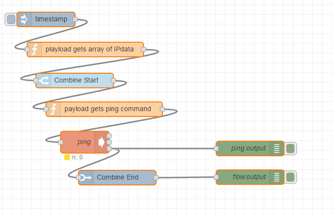

Node-red Flow Combine
========================

[](https://www.redconnect.io/addons) 

Install
-------

Run the following command in the root directory of your Node-RED install

    npm install node-red-contrib-flow-combine

## Overview

Combine multiple flows into one waiting until a number (static or dynamic) of iterations are made.


## Combine Start

This node defines from which point the flow splits.

The node have the following properties :

### Wait an Array

If this property is checked, then the number of iterations which *Combine End* waits is the length of the Array.

### Iterate over the Array
Split the Array on multiple messages.


### Number of flows

If the other property is unchecked then the node *Combine End* will wait the number written in this property.

## Combine End

This node doesn't produce any Output until all the expected iterations are done.


The node have the following properties :

### Output processed data

If this property is checked, then the node collects in an Array, data from each iteration and at the end provides that in the payload.
If on the start node is enabled *Iterate over the Array* the elements of the result Array have the same order as in the input Array.

## Example flow:
<p align="center">
  
</p>

```
[{"id":"80480437.a50088","type":"inject","z":"babe16cd.862588","name":"","topic":"","payload":"","payloadType":"date","repeat":"","crontab":"","once":false,"x":111,"y":91,"wires":[["f143d1a6.e1a4e"]]},{"id":"f143d1a6.e1a4e","type":"function","z":"babe16cd.862588","name":"playload gets array of IPdata","func":"var payload = [{ IPdata: \"127.0.0.1\" },{ IPdata: \"127.0.0.1\" },{ IPdata: \"127.0.0.1\" }]\nmsg.payload = payload;\nreturn msg;\n","outputs":1,"noerr":0,"x":192,"y":153,"wires":[["6c98124b.859c7c"]]},{"id":"6c98124b.859c7c","type":"Combine Start","z":"babe16cd.862588","name":"","number":0,"waitArray":1,"iterateArray":1,"x":170,"y":217,"wires":[["ab5d1a5d.4460a8"]]},{"id":"ab5d1a5d.4460a8","type":"function","z":"babe16cd.862588","name":"payload gets ping command","func":"msg.payload = \"ping -c1 -W1 \" + msg.payload.IPdata;\nreturn msg;","outputs":1,"noerr":0,"x":231,"y":276,"wires":[["78d5a898.bcd098"]]},{"id":"78d5a898.bcd098","type":"exec","z":"babe16cd.862588","command":" ","addpay":true,"append":"","useSpawn":true,"timer":"","name":"ping","x":191,"y":344,"wires":[[],[],["bd829090.281b5","622778df.d987b8"]]},{"id":"bd829090.281b5","type":"Combine End","z":"babe16cd.862588","name":"","saveOutput":1,"x":258,"y":417,"wires":[["4de5d4b8.f5e26c"]]},{"id":"622778df.d987b8","type":"debug","z":"babe16cd.862588","name":"ping.output","active":true,"console":"false","complete":"payload","x":532,"y":357,"wires":[]},{"id":"4de5d4b8.f5e26c","type":"debug","z":"babe16cd.862588","name":"flow.output","active":true,"console":"false","complete":"payload","x":532,"y":416,"wires":[]}]
```
